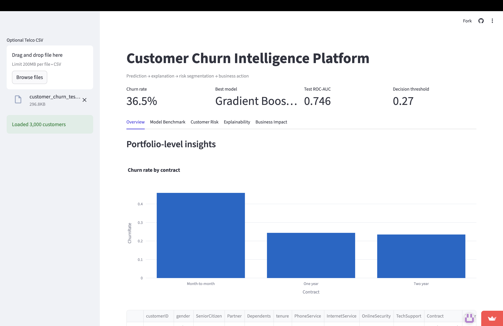
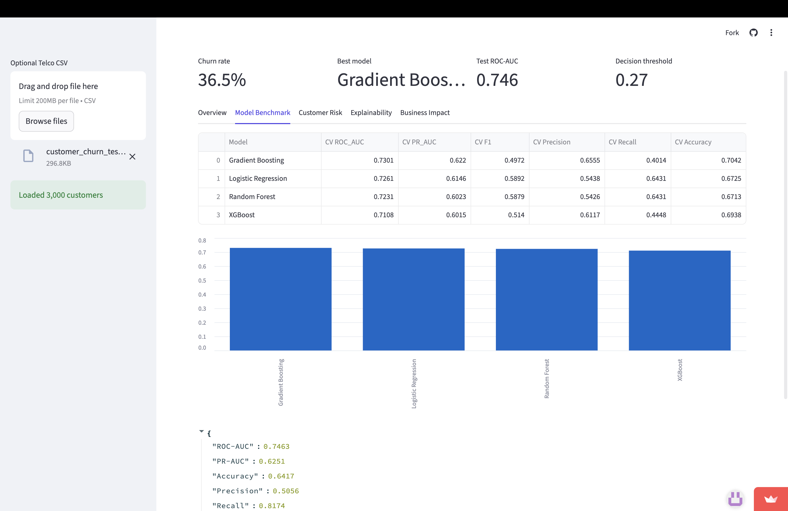
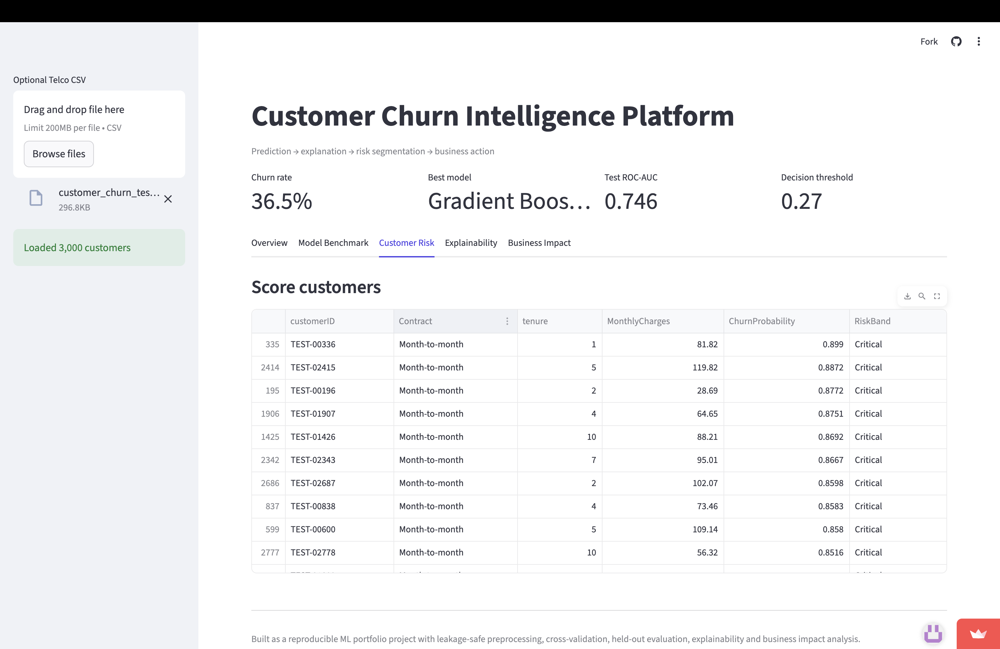
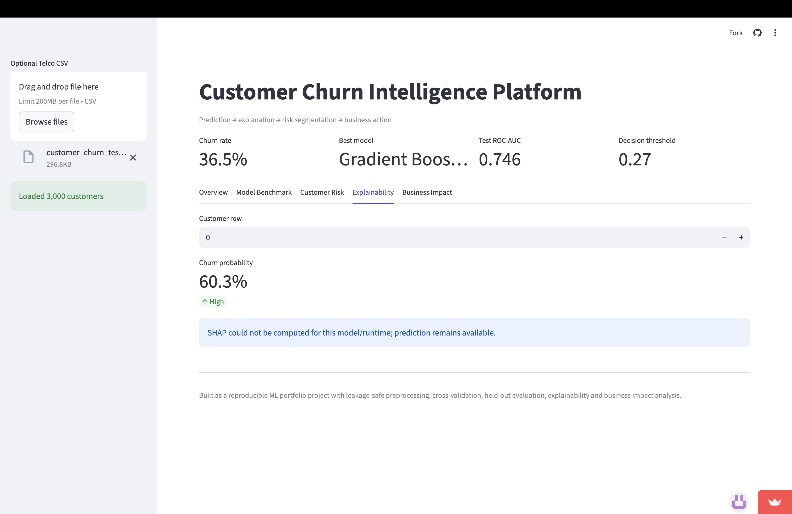
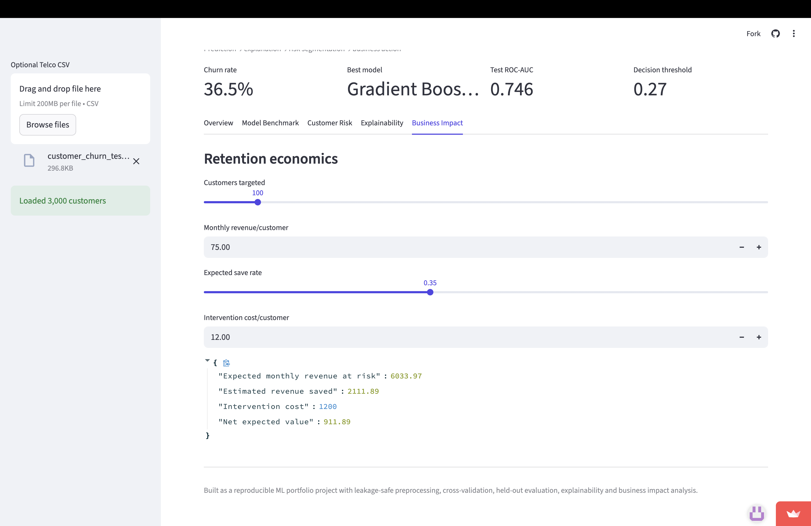

# Customer Churn Intelligence Platform

> An end-to-end machine learning application for customer churn prediction, risk segmentation, explainable AI, and retention business impact analysis.

[](https://www.python.org/)
[](https://streamlit.io/)
[](https://scikit-learn.org/)
[](https://xgboost.readthedocs.io/)
[](https://fastapi.tiangolo.com/)
[](https://pytest.org/)

## 🚀 Live Demo

**Streamlit Application:**  
https://customer-churn-prediction-akvxzgjsjcfaqchilwzygz.streamlit.app/

**GitHub Repository:**  
https://github.com/Ashokreddy45/customer-churn-prediction

---

## 📌 Project Overview

Customer churn is a major business problem for subscription-based companies because losing an existing customer can directly reduce recurring revenue and customer lifetime value.

This project develops an end-to-end **Customer Churn Intelligence Platform** that goes beyond simply predicting whether a customer will churn.

The platform answers three practical questions:

1. **Which customers are most likely to churn?**
2. **Why is a particular customer considered high risk?**
3. **What could the business gain by taking retention action?**

The system combines:

- Data preprocessing
- Leakage-safe feature engineering
- Machine learning model benchmarking
- Probability-based churn prediction
- Decision threshold optimization
- Customer risk segmentation
- SHAP-based explainability
- Retention business impact simulation
- Interactive Streamlit visualization
- FastAPI service support
- Automated testing

---

# 🎯 Problem Statement

A traditional churn model may output a prediction such as:

```text
Customer A → 78% probability of churn
```

However, a business needs more information than a probability.

A useful churn intelligence system should help answer:

```text
Who is at risk?
      ↓
How serious is the risk?
      ↓
Why is the customer at risk?
      ↓
Should the business intervene?
      ↓
What could the intervention be worth?
```

This project was designed around that complete workflow.

---

# 🔄 End-to-End Workflow

```text
                    Customer Data
                         │
                         ▼
              Data Cleaning & Validation
                         │
                         ▼
              Feature Preparation Pipeline
                         │
                         ▼
                  Train/Test Split
                         │
                         ▼
                Cross-Validation
                         │
                         ▼
                Model Benchmarking
                         │
                         ▼
                 Best Model Selection
                         │
                         ▼
               Churn Probability Score
                         │
                         ▼
             Decision Threshold Optimization
                         │
                         ▼
              Customer Risk Segmentation
                         │
              ┌──────────┴──────────┐
              ▼                     ▼
        SHAP Explainability   Business Impact
              │                     │
              └──────────┬──────────┘
                         ▼
                Streamlit Dashboard
```

---

# 📊 Current Demonstration Results

The repository includes a synthetic Telco-style demonstration dataset containing **5,000 customer records**.

| Metric | Current Result |
|---|---:|
| Customers | 5,000 |
| Churn Rate | 42.0% |
| Best Model | Logistic Regression |
| Test ROC-AUC | 0.769 |
| Decision Threshold | 0.42 |

> These values represent the current demonstration dataset and configuration. They are not presented as production performance or as results from a real customer population.

---

# 📸 Application Screenshots

## Overview

The Overview dashboard provides a high-level view of the customer population and churn behavior.



---

## Model Benchmark

The Model Benchmark section compares the evaluated machine learning models and reports their cross-validation performance.



---

## Customer Risk

The Customer Risk section scores customers according to predicted churn probability and assigns a corresponding risk band.



---

## Explainability

The Explainability section allows an individual customer prediction to be investigated using model explanation outputs.



---

## Business Impact

The Business Impact section connects model predictions with a simplified retention economics simulation.



---

# 🤖 Machine Learning Approach

The project evaluates multiple classification algorithms:

- Logistic Regression
- Random Forest
- Gradient Boosting
- XGBoost

Models are benchmarked using cross-validation before selecting the best-performing model.

The current demonstration selects **Logistic Regression** based on the benchmarked ROC-AUC result.

---

# 🧹 Data Processing

The preprocessing workflow includes:

- Column name normalization
- Duplicate removal
- Numeric conversion for `TotalCharges`
- Target encoding
- Missing-value handling
- Numeric feature scaling
- Categorical feature encoding

The preprocessing pipeline uses separate numeric and categorical transformations.

### Numeric features

Numeric features are processed using:

```text
Median Imputation
       ↓
Standard Scaling
```

### Categorical features

Categorical features are processed using:

```text
Most-Frequent Imputation
       ↓
One-Hot Encoding
```

Unknown categorical values are handled using:

```python
OneHotEncoder(handle_unknown="ignore")
```

This helps keep preprocessing consistent between training and inference.

---

# 📈 Model Evaluation

The application evaluates classification performance using:

- ROC-AUC
- F1 Score
- Precision
- Recall
- Confusion Matrix

Model benchmarking uses cross-validation on the training data.

A separate held-out test set is then used for final evaluation.

This separation helps avoid using the test set during model selection.

---

# 🎚️ Decision Threshold Optimization

Binary classification does not always need to use the default probability threshold of `0.50`.

This project calculates a decision threshold based on validation/test prediction behavior and uses the resulting threshold when converting probabilities into classification decisions.

For the current demonstration:

```text
Decision Threshold = 0.42
```

The threshold can affect:

- Precision
- Recall
- F1 Score
- Number of customers classified as high risk

This is important in churn applications because the business cost of missing a high-risk customer may differ from the cost of contacting a customer who ultimately remains.

---

# 🚨 Customer Risk Segmentation

Each customer receives a predicted churn probability.

The probability is then mapped into a risk band.

Conceptually:

```text
Customer
    ↓
Churn Probability
    ↓
Risk Band
    ↓
Retention Priority
```

This provides a more actionable output than a simple binary prediction.

The Customer Risk dashboard allows users to identify customers with the highest predicted churn probability.

---

# 🔍 Explainable AI

A churn prediction should ideally be interpretable to the people using it.

The project therefore includes SHAP-based explainability.

The Explainability section allows a user to select a customer and inspect the model's contribution information for that prediction.

The objective is to move from:

```text
"Customer is high risk."
```

toward:

```text
"Customer is high risk, and these model features
contributed to the prediction."
```

If SHAP cannot be calculated for a particular model/runtime configuration, the application preserves the prediction functionality and reports that explanation output is unavailable.

---

# 💰 Business Impact Analysis

Machine learning predictions become more useful when they can be connected to business decisions.

The Business Impact section provides a simplified retention simulation.

Users can configure:

- Number of customers targeted
- Monthly revenue per customer
- Expected retention/save rate
- Intervention cost per customer

The simulation estimates the potential economics of a retention campaign.

Conceptually:

```text
High-Risk Customers
        ↓
Retention Campaign
        ↓
Expected Saved Customers
        ↓
Revenue Retained
        ↓
Intervention Cost
        ↓
Estimated Net Impact
```

This section is intended as a decision-support demonstration rather than a financial forecasting system.

---

# 🏗️ Architecture

```text
┌─────────────────────────────┐
│       Customer Dataset      │
└──────────────┬──────────────┘
               │
               ▼
┌─────────────────────────────┐
│ Data Cleaning & Validation  │
└──────────────┬──────────────┘
               │
               ▼
┌─────────────────────────────┐
│ Feature Engineering         │
│ Numeric + Categorical       │
│ Preprocessing               │
└──────────────┬──────────────┘
               │
               ▼
┌─────────────────────────────┐
│ Train / Test Split          │
└──────────────┬──────────────┘
               │
               ▼
┌─────────────────────────────┐
│ Cross-Validation            │
│ Model Benchmarking          │
└──────────────┬──────────────┘
               │
               ▼
┌─────────────────────────────┐
│ Final Selected Model        │
└──────────────┬──────────────┘
               │
       ┌───────┼────────┐
       │       │        │
       ▼       ▼        ▼
    Risk    SHAP     Business
   Scoring  Explain   Impact
       │       │        │
       └───────┼────────┘
               ▼
┌─────────────────────────────┐
│     Streamlit Dashboard     │
└─────────────────────────────┘
```

More detailed architecture information is available in:

[`docs/ARCHITECTURE.md`](docs/ARCHITECTURE.md)

---

# 📁 Project Structure

```text
customer-churn-intelligence-platform/
│
├── app.py
├── api.py
├── requirements.txt
├── runtime.txt
├── Makefile
├── README.md
├── run.sh
├── train.sh
├── api.sh
│
├── data/
│   └── demo_telco_churn.csv
│
├── src/
│   └── churn/
│       ├── data.py
│       ├── features.py
│       ├── models.py
│       ├── evaluation.py
│       ├── explainability.py
│       └── business.py
│
├── tests/
│
├── scripts/
│
├── docs/
│   ├── API.md
│   ├── ARCHITECTURE.md
│   ├── DATA_DICTIONARY.md
│   ├── MODEL_CARD.md
│   └── PROJECT_REPORT.md
│
├── screenshots/
│   ├── overview.png
│   ├── model-benchmark.png
│   ├── customer-risk.png
│   ├── explainability.png
│   └── business-impact.png
│
└── .github/
    └── workflows/
```

---

# 🛠️ Technology Stack

| Category | Technologies |
|---|---|
| Language | Python 3.12 |
| Data Processing | Pandas, NumPy |
| Machine Learning | Scikit-learn, XGBoost |
| Explainability | SHAP |
| Visualization | Plotly |
| Dashboard | Streamlit |
| API | FastAPI, Uvicorn |
| Model Persistence | Joblib |
| Testing | Pytest |
| Deployment | Streamlit Community Cloud |

---

# 🚀 Running the Project Locally

## 1. Clone the repository

```bash
git clone https://github.com/Ashokreddy45/customer-churn-prediction.git
cd customer-churn-prediction
```

## 2. Create a virtual environment

```bash
python3 -m venv .venv
```

## 3. Activate the environment

macOS / Linux:

```bash
source .venv/bin/activate
```

Windows:

```powershell
.venv\Scripts\activate
```

## 4. Install dependencies

```bash
pip install -r requirements.txt
```

## 5. Run the Streamlit application

```bash
python -m streamlit run app.py
```

The application will then be available through the local Streamlit URL shown in the terminal.

---

# ⚡ FastAPI Service

The project also contains a FastAPI service in:

```text
api.py
```

Start the API locally using:

```bash
uvicorn api:app --reload
```

The automatically generated API documentation is available at:

```text
http://127.0.0.1:8000/docs
```

See [`docs/API.md`](docs/API.md) for additional information.

---

# 🧪 Testing

Automated tests are included in the `tests/` directory.

Run:

```bash
python -m pytest -q
```

Current local test status:

```text
3 passed
```

The tests provide a basic regression check for core project functionality.

---

# 📚 Technical Documentation

Detailed documentation is available in the `docs/` directory.

| Document | Description |
|---|---|
| [Architecture](docs/ARCHITECTURE.md) | System architecture and data flow |
| [API Documentation](docs/API.md) | FastAPI service information |
| [Data Dictionary](docs/DATA_DICTIONARY.md) | Dataset columns and definitions |
| [Model Card](docs/MODEL_CARD.md) | Model purpose, evaluation, limitations and responsible use |
| [Project Report](docs/PROJECT_REPORT.md) | Detailed technical project report |

---

# 🔐 Data and Privacy

The repository uses a synthetic Telco-style demonstration dataset.

No private customer information is intended to be included in the repository.

The included data should therefore be treated as demonstration data rather than production customer data.

---

# ⚠️ Limitations

This project is a portfolio and demonstration system rather than a production churn platform.

Important limitations include:

- The included dataset is synthetic.
- Demonstration performance may not represent real-world performance.
- The business impact calculation uses user-defined assumptions.
- Model performance may change on a different customer population.
- Churn probability should not be interpreted as a guaranteed outcome.
- SHAP explanations describe model behavior and should not automatically be interpreted as causal relationships.

---

# 🔮 Future Improvements

Potential future development includes:

- Real-time customer scoring
- Automated model retraining
- Model drift monitoring
- Experiment tracking
- Hyperparameter optimization
- Production database integration
- Customer-specific retention recommendations
- Authentication and role-based access
- Model monitoring dashboards
- Cloud-based scalable inference
- Automated model performance reporting

---

# 👨‍💻 Author

**Ashok Reddy Damireddy**

B.Tech in Computer Science and Engineering  
Specialization: Data Science & Big Data Analytics

GitHub:  
https://github.com/Ashokreddy45

---

# 📄 License

This project is intended for educational, portfolio, and demonstration purposes.